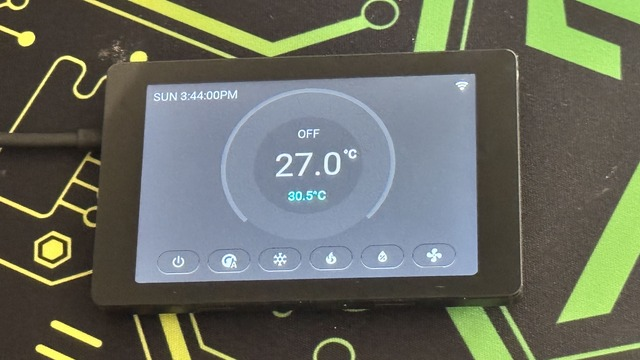
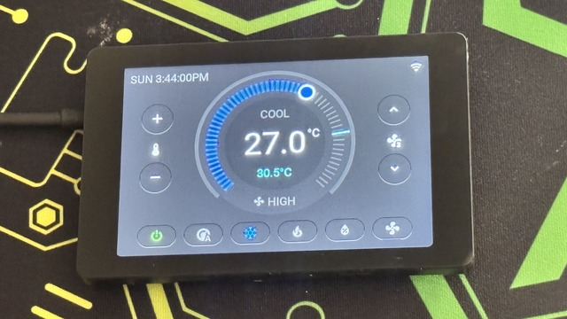
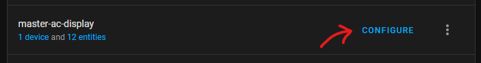
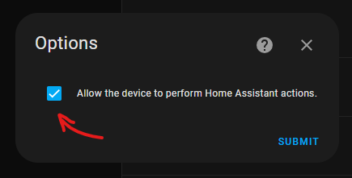
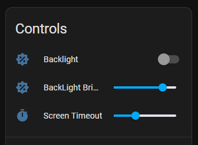

# Climate Control Display with ESPHome and LVGL
An ESPHome-based smart climate control interface for Home Assistant using WT32-SC01 Plus display.

[](https://esphome.io)
[](https://opensource.org/licenses/MIT)





## Demo Video

<a href="https://www.youtube.com/watch?v=l97-AFoVEJQ" target="_blank" rel="noopener noreferrer">▶ Click here to watch a short demo</a>

### 3D Print Case

[Thingiverse - WT32-SC01 PLUS wall enclosure](https://www.thingiverse.com/thing:6683758)

## Table of Contents
- [Hardware Requirements](#hardware-requirements)
- [Features](#features)
- [Installation](#installation)
- [Configuration](#configuration)
- [GPIO Pinout](#gpio-pinout)
- [Dependencies](#dependencies)
- [Development](#development)
- [References](#references)

## Hardware Requirements
- **Display Module**: [Wireless-Tag WT32-SC01 PLUS](https://robu.in/product/wireless-tag-wt32-sc01-plus-esp32s3-based-3-5-inch-iot-display/) (ZX3D50CE08S-v15-USRC) 
  - 3.5 inch 320x480 LCD
  - Screen Resolution: 480 x 320
  - Interface: 8080
  - ST7796UI driver with MCU8080 8Bit interface
  - RGB565 color
  - ILI9488 controller
  - Single touch capacitive FT6336U I2S
  - MCU: ESP32-S3 (ESP32-WROVER-B)
  - WiFi + BT + BLE
  - 4MB SPI flash
  - 8MB PSRAM

## Features

### Core Functionality
- Real-time temperature monitoring and control
- Multiple HVAC modes:
  - Auto
  - Cool
  - Heat
  - Dry
  - Fan Only
- Fan speed control modes
  - Auto
  - Low
  - Medium
  - Diffuse
- Touch-sensitive interface

### Display Features
- Auto-dimming display
- Time display with AM/PM format
- WiFi status indication

## Setup Steps

### Prerequisites
1. Home Assistant with ESPHome installed
2. WT32-SC01 Plus display module
3. USB-C cable for flashing

1. Install ESPHome in your Home Assistant instance
2. Create a new ESPHome device
3. Copy the configuration files:
   ```bash
   git clone https://github.com/hareeshmu/climate-control-display.git
   cd climate-control-display
   ```

4. Update `secrets.yaml`:
   ```yaml
   # filepath: secrets.yaml
   wifi_ssid: "Your_WiFi_SSID"
   wifi_password: "Your_WiFi_Password"
   fallback_password: "AP_Fallback_Password"
   ota_password: "OTA_Update_Password"
   api_key_b64: "Your_Base64_API_Key"
   ```

5. Configure your device in `master-ac-display.yaml`:
   ```yaml
   # filepath: master-ac-display.yaml
   substitutions:
     device_name: 'master-ac-display'
     friendly_name: 'master-ac-display'
     climate_entity: climate.master_ac  # Your HA climate entity
   ```

## Configuration

### Home Assistant Settings

After flashing the device, Home Assistant will discover automatically.

Nake sure the at you have enabled `Allow the device to perform Home Assistant Actions`





#### Device Controls 



### Display Settings
| Setting | Range | Default | Description |
|---------|--------|---------|-------------|
| Brightness | 5-100% | 50% | Screen brightness |
| Timeout | 10-300s | 300s | Screen timeout |

### Temperature Control
- Range: 16°C - 34°C
- Step: 0.5°C increments
- Visual circular gauge feedback

### Fan Modes
| Mode | Icon | Description |
|------|------|-------------|
| Off | ⭘ | Fan disabled |
| Auto | ⟲ | Automatic control |
| Low | ① | Low speed |
| Medium | ② | Medium speed |
| High | ③ | High speed |
| Diffuse | ⟳ | Diffuse mode |

## GPIO Pinout

### Display Interface
```
Display Control:
- SDA: GPIO6
- SCL: GPIO5
- DC:  GPIO0
- WR:  GPIO47
- RST: GPIO4
- BL:  GPIO45

Data Bus:
- D0: GPIO9
- D1: GPIO46
- D2: GPIO3
- D3: GPIO8
- D4: GPIO18
- D5: GPIO17
- D6: GPIO16
- D7: GPIO15
```

## Dependencies

### Required Software
- ESPHome 2025.2.1+
- Home Assistant Core
- LVGL UI Components

### Optional Tools
- PlatformIO
- Visual Studio Code with ESPHome extension

## Development

### Build and Upload
```bash
esphome run master-ac-display.yaml
```

### Building
```bash
esphome compile master-ac-display.yaml
```

### Uploading
```bash
esphome upload master-ac-display.yaml
```

### Debugging
```bash
esphome logs master-ac-display.yaml
```

### Clean
```bash
esphome clean master-ac-display.yaml
```

## References

### Documentation
- [WT32-SC01 Plus Datasheet](https://www.marutsu.co.jp/contents/shop/marutsu/datasheet/khe_WT32-SC01-PLUS.pdf)
- [ESPHome FT63x6 Documentation](https://esphome.io/components/touchscreen/ft63x6.html)
- [LVGL Cookbook](https://esphome.io/cookbook/lvgl.html)
- [ESP32 Forum Discussion](https://www.esp32.com/viewtopic.php?t=39219)

## License

MIT License

## Contributing

1. Fork the repository
2. Create your feature branch
3. Commit your changes
4. Push to the branch
5. Create a Pull Request

---

Made with ❤️ by kpr
